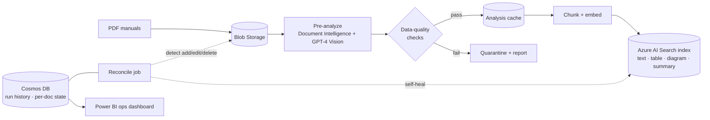

# RAG Data Ingestion Pipeline (Azure)

> The **data-engineering backbone** for enterprise RAG: ingest PDF manuals → analyze (Document Intelligence + GPT‑4 Vision) → chunk → embed → load a multimodal Azure AI Search index — with reconciliation, state tracking, and operational tooling.

  -0078D4) 


---

## Why this exists

Every enterprise RAG system is only as good as the pipeline that feeds it. This is that pipeline, built like real data engineering: **idempotent, incremental, observable, and self-healing**. It converts a folder of messy technical PDFs into a clean, multimodal, citable search index — and keeps that index in sync as documents are added, edited, or deleted.

Each manual becomes four peer record types: `text`, `table`, `diagram` (GPT‑4 Vision description + OCR), and `summary` — all embedded and returned with citation metadata (manual, page, headers, bounding box).

## Architecture



## Data-engineering features

- **Two-stage pipeline** — slow offline analysis writes a cache; the fast loader reads it (no re-analysis, no timeouts).
- **Reconciliation / self-healing** — added, edited, and deleted PDFs are detected automatically and the index converges to match source.
- **State + lineage** — per-document state and run history in Cosmos DB, surfaced in a Power BI operations dashboard.
- **Idempotent + resumable** — pipeline locks, stale-row reaping, failed-doc reruns.
- **Managed identity** — `DefaultAzureCredential`, no keys in code.

## Repository layout

```
function_app/   Custom Azure Function skills (Document Intelligence, Vision)
scripts/        preanalyze · reconcile · deploy · diagnostics · smoke tests
search/         index / datasource / skillset / indexer templates
tests/          unit + end-to-end (pure-Python)
docs/           setup, runbook, scenarios
```

## Quickstart

```bash
pip install -r requirements.txt
cp deploy.config.example.json deploy.config.json   # commercial-Azure values
python scripts/deploy_search.py && python scripts/run_pipeline.py
```

## Data quality & evaluation

- Ingestion validation: page/section extraction rates, empty-chunk detection, embedding coverage.
- Index health: record counts per type, orphan detection, reconciliation drift = 0.
- Retrieval quality feeds the shared `mangos-rag-eval` harness (faithfulness, context recall).

## Roadmap

- Orchestration via **Airflow / Databricks** DAGs with retries + alerting.
- **Great Expectations** data-quality gates in CI.
- **DVC**-versioned corpora + embeddings.
- AWS variant: S3 → Textract/Bedrock → OpenSearch behind provider interfaces.

---
